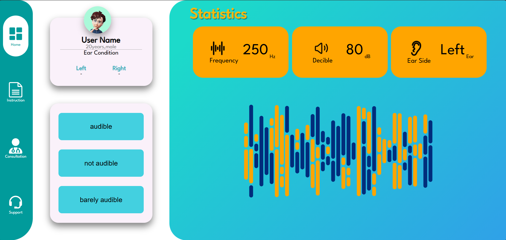
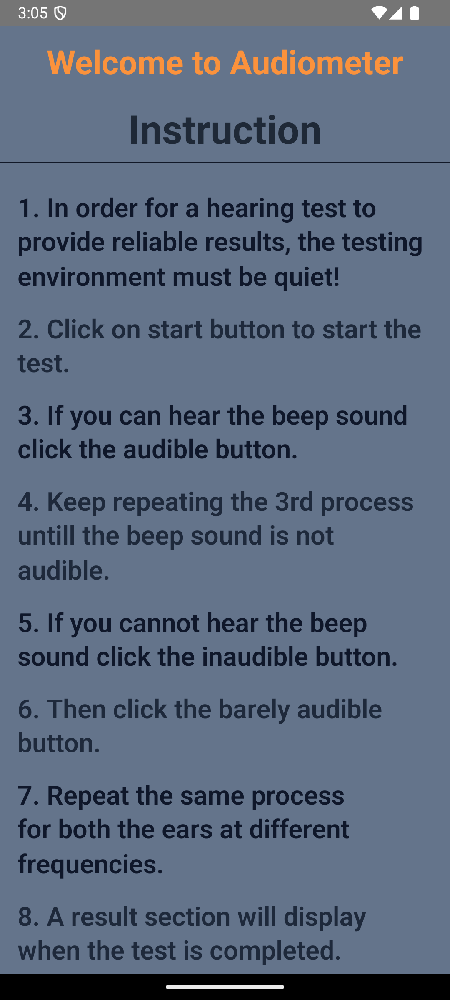
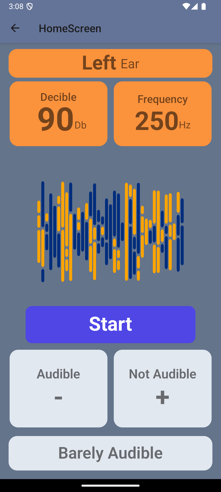
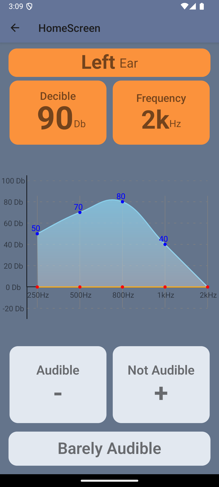
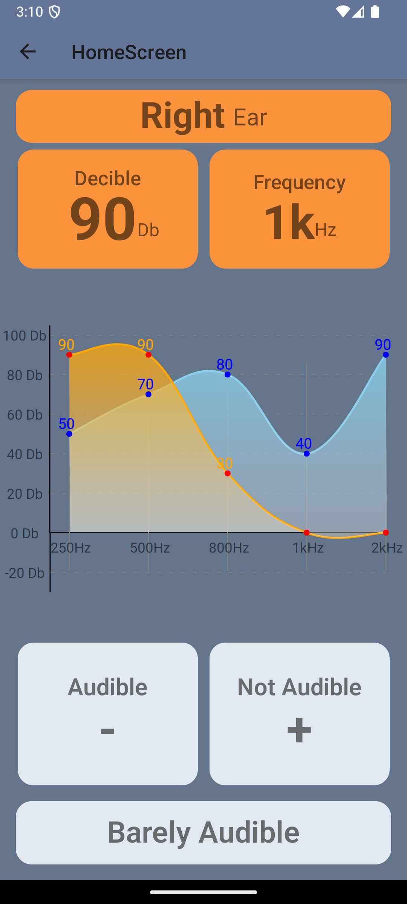
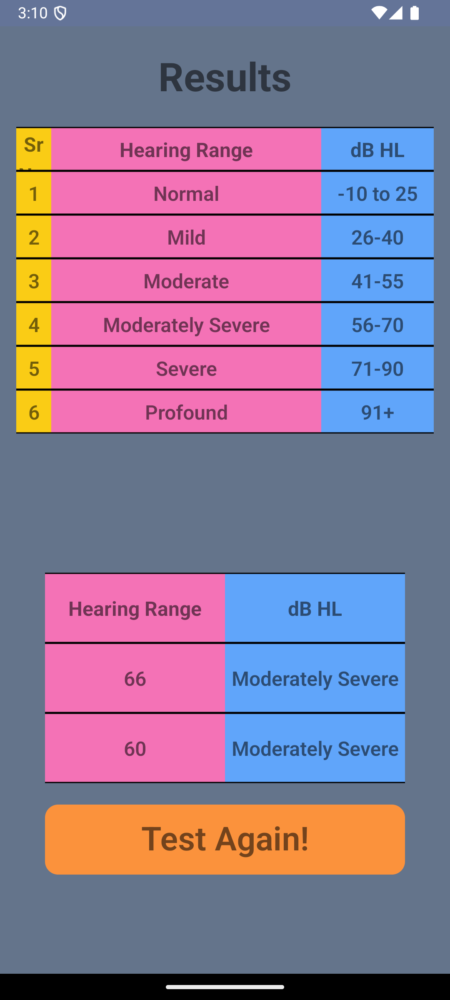

# Digital Audiometer - React Native Version

This project is a mobile app-based digital audiometry platform developed as part of **SIH 2023**, designed for users to assess their hearing through an interactive mobile experience.

### Table of Contents

- [How to Use](#how-to-use)
- [Audiometer Functionality](#audiometer-functionality)
- [Left and Right Ear Frequency Testing](#left-and-right-ear-frequency-testing)
- [Results](#results)
- [Web Version](#web-version)

## Web Version

For desktop users, check out the [Web Version of this project](https://github.com/varunvaatsalya/Digital-Audimeter):

<p align="center">
  <a href="https://github.com/varunvaatsalya/Digital-Audimeter">
    
  </a>
</p>

## How to Use

On the first page, users will receive instructions on how to use the audiometry app effectively.

<p align="center">
    
</p>

## Audiometer Functionality

The second page offers a step-by-step hearing test, where users input their responses to varying audio frequencies and intensities.

<p align="center">
    
</p>

## Left and Right Ear Frequency Testing

The audiometer in the app also allows users to test both ears separately. You can hear sound samples at different frequencies for the left and right ear, ensuring a thorough hearing assessment.

Here are examples of the frequency tests:

- **Left Ear Sample at 500 Hz**:
  <p align="center">
    
</p>

- **Right Ear Sample at 1000 Hz**:
  <p align="center">
    
</p>

This functionality helps detect hearing differences between ears at different pitches.

## Results

After completing the test, an audiogram is generated, showing the user's hearing sensitivity across a range of frequencies.

<p align="center">
    
</p>

## React Web Version

Check out the [React Web Version of this project](https://github.com/varunvaatsalya/digital-audiometer) for Desktop or Web users.


### About the project's tech stack

This is a [**React Native**](https://reactnative.dev) project, bootstrapped using [`@react-native-community/cli`](https://github.com/react-native-community/cli).

# Getting Started

> **Note**: Make sure you have completed the [React Native - Environment Setup](https://reactnative.dev/docs/environment-setup) instructions till "Creating a new application" step, before proceeding.

## Step 1: Start the Metro Server

First, you will need to start **Metro**, the JavaScript _bundler_ that ships _with_ React Native.

To start Metro, run the following command from the _root_ of your React Native project:

```bash
# using npm
npm start

# OR using Yarn
yarn start
```

## Step 2: Start your Application

Let Metro Bundler run in its _own_ terminal. Open a _new_ terminal from the _root_ of your React Native project. Run the following command to start your _Android_ or _iOS_ app:

### For Android

```bash
# using npm
npm run android

# OR using Yarn
yarn android
```

### For iOS

```bash
# using npm
npm run ios

# OR using Yarn
yarn ios
```

If everything is set up _correctly_, you should see your new app running in your _Android Emulator_ or _iOS Simulator_ shortly provided you have set up your emulator/simulator correctly.

This is one way to run your app — you can also run it directly from within Android Studio and Xcode respectively.

## Step 3: Modifying your App

Now that you have successfully run the app, let's modify it.

1. Open `App.tsx` in your text editor of choice and edit some lines.
2. For **Android**: Press the <kbd>R</kbd> key twice or select **"Reload"** from the **Developer Menu** (<kbd>Ctrl</kbd> + <kbd>M</kbd> (on Window and Linux) or <kbd>Cmd ⌘</kbd> + <kbd>M</kbd> (on macOS)) to see your changes!

   For **iOS**: Hit <kbd>Cmd ⌘</kbd> + <kbd>R</kbd> in your iOS Simulator to reload the app and see your changes!

## Congratulations! :tada:

You've successfully run and modified your React Native App. :partying_face:

